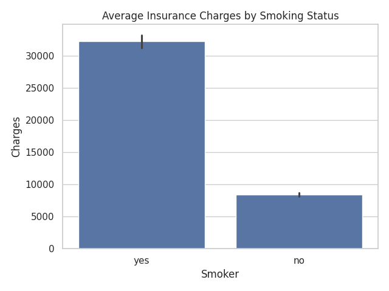

# Medical Insurance Charges Analysis

## Project Overview
This project analyses medical insurance charges to understand how factors such as age, BMI, smoking status, and region affect insurance costs.

The analysis is done using Python and is intended to demonstrate data analysis, data cleaning, and basic exploratory data analysis (EDA) skills.

## Objectives
- Explore key drivers of medical insurance charges
- Compare charges across demographic groups
- Identify high-risk and high-cost segments
- Practice Python-based data analysis for actuarial/data roles

## Tools Used
- Python
- Pandas
- Matplotlib / Seaborn
- GitHub Codespaces
  ## Key Visual Insights

### Smoking Status vs Insurance Charges

### Age vs Insurance Charges

### BMI vs Insurance Charges

## Key Performance Indicators (KPIs)

The following KPIs were used to assess the drivers of medical insurance charges:

- **Average Insurance Charge**  
  Mean cost across all policyholders. Used as a baseline for comparison.

- **Median Insurance Charge**  
  Reduces the effect of extreme high-cost cases.

- **Smoking Cost Differential**  
  Difference in average charges between smokers and non-smokers.  
  This emerged as the strongest cost driver.

- **Age-Based Cost Gradient**  
  Average charges by age band to observe how risk and cost increase with age.

- **BMI Risk Indicator**  
  Relationship between BMI levels and insurance charges to identify high-risk profiles.
 
